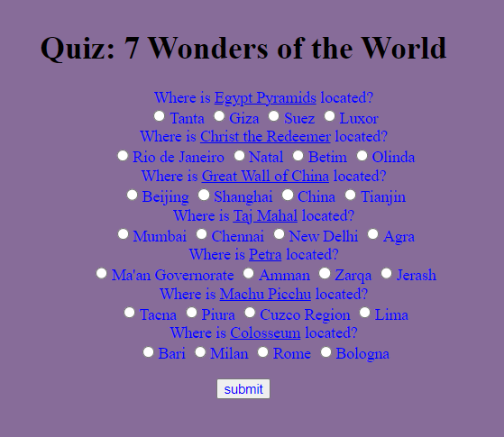
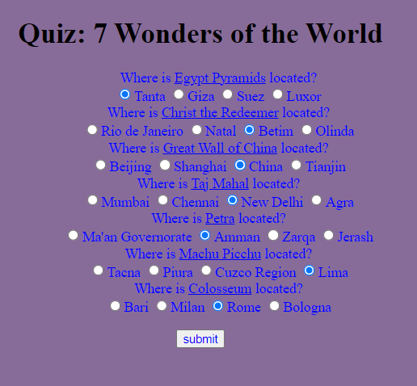
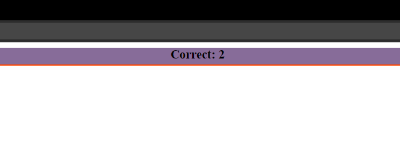

# BLITZQUIZ 

link: http://127.0.0.1:5000/

Документация разработчика:

1. def shuffle(q) - Функция, которая рандомизирует значения из словаря
2. def quiz() -  Функция для формирования викторины, также рендерит html
3. def quiz_answers() - Функция подсчёта и вывода правильных ответов
4. main.html и css определяют вид страницы, которую видит пользователь (смотреть картинки ниже)

 

Викторина

 

Прохождение викторины

 

Результат викторины

Документация пользователя:

1. Зайти за сайт
2. Пройти викторину
3. Получить результат викторины
